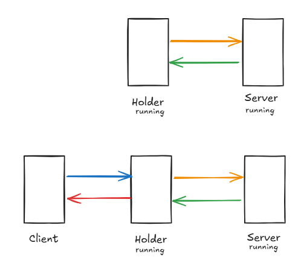
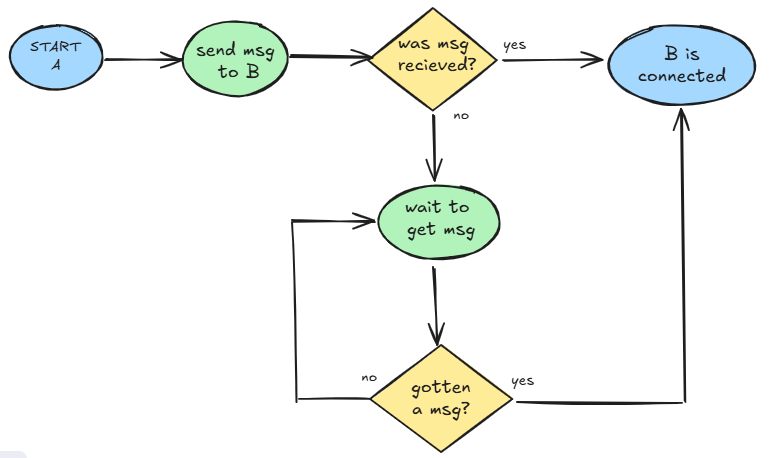

## Funcionamiento y conexiones del servidor, tenedor y cliente
Antes de poder iniciar pedidos desde el cliente, se sabe que tanto el servidor como el tenedor deben haberse iniciado y conectado correspondientemente. Luego de que estos hayan sido conectados, el cliente puede enviar solicitudes.

Sin embargo, entre tenedor y servidor no existe una jerarquía que defina cuál de los dos pueda ejecutarse primero. En tal caso, es necesario diseñar una comunicación dual que pueda soportar que la otra parte esté conectada o desconectada. Para ello, se propone un flujo sencillo de la inicialización de programas, que aplicaría tanto para el servidor como para el tenedor, siendo A y B las partes involucradas.

Siguiendo el diagrama:
* Una vez que se corre, A le envía un mensaje a B y espera. Si el mensaje fue recibido correctamente (retorna 0), significa que B está conectado también.
* Si el mensaje enviado no fue recibido, B no está disponible, por lo que A deberá aguardar pasivamente hasta recibir un mensaje de B.
* Si recibe un mensaje se habrá conectado exitosamente.
* A partir de este momento, A y B se quedarán inactivos (pero corriendo) esperando solicitudes de parte de algún cliente que se conecte al servidor.

## Propuesta de protocolo
Para desarrollar este proyecto, se plantea la idea de una comunicación simple e intuitiva, como va siendo la de HTTP entre Cliente-Tenedor. En esta ocasión, se necesita una funcionalidad general de leer mensajes recibidos, que incluirán el archivo .txt si la solicitud fue válida, o bien, un mensaje de error en caso contrario.

### Servidor
El servidor, como no tiene comunicación directa con el cliente, solo envía mensajes al tenedor, que pueden ser los siguientes, donde FLAG puede ser ONE o ALL (dependiendo del pedido obtenido previamente del Tenedor):
* **[FLAG] [status] [_response_]**: el status, 1 de exito y 0 de fracaso, indica si el resto del contenido es un archivo (siendo la flag ONE) o un directorio (siendo ALL). De ser fracaso, la respuesta es un mensaje de error, NF.

### Tenedor
El tenedor podrá acceder a buscar lo solicitado en los servidores disponibles, enviando estos mensajes:
* **ALL**: Si recibió ALL del cliente, el tenedor jalará el directorio del servidor actual para mostrarle después la lista de archivos disponibles al cliente.
* **ONE [_file.txt_]**: Solicitar directamente un archivo .txt específico. Aquí, se retornaría el contenido entero del archivo pedido. El formato que se esperaría a partir de esta bandera sería ONE archivo.txt.
