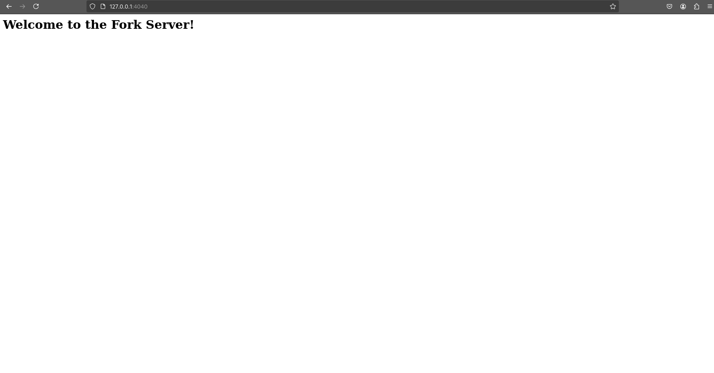
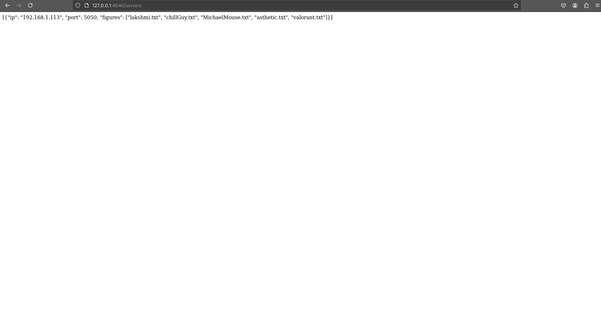
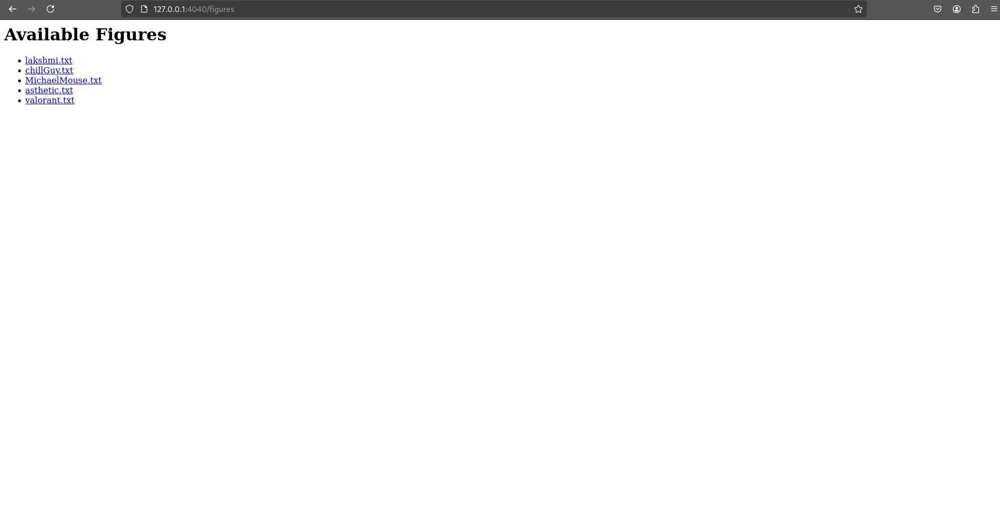
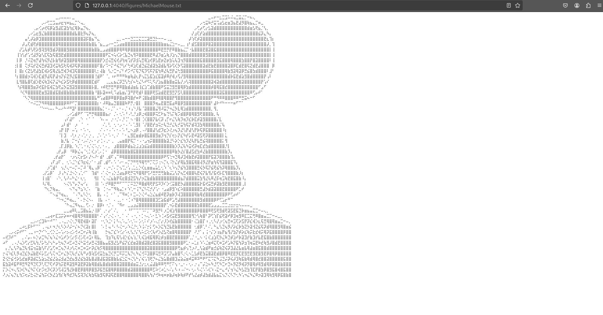

# Fork Server

## Table of Contents

- [Overview](#overview)
- [Project Structure](#project-structure)
- [Compilation Steps](#compilation-steps)
- [Running the Server](#running-the-server)
- [Running fork](#running-fork)
- [Once all components are running](#once-all-components-are-running)
- [Testing with the Browser](#testing-with-the-client)


## Overview
This project implements a fork server that allows clients to HTTP requests to a web server. The server can handle multiple clients and supports both UDP and TCP protocols. It also includes a file system library for managing files and directories.

## Project Structure
```
project/
├── fork/
├── server/
├── file_system/
```
Each directory contains the source code for the respective components of the project.

## Compilation Steps
1. Navigate to the `fork` directory and run `make` to compile the fork server.
2. Navigate to the `file_system` directory and run `make` to compile the file system library.
3. Navigate to the `server` directory and run `make` to compile the web server.

<span style="color: red;">**Note:** Ensure compile the File System Library before compiling the server, as the server depends on the file system library. If you do not compile the file system library first, you will encounter errors during the server compilation.</span>
</span>

## Running the Server
1. Navigate to the `server` directory.
2. Run the server using the command:

    ```bash
    ./server <port>
    ```

Replace `<port>` with the desired port number for the server to listen on.


After starting the server you will see a message like this:

```./bin/server 5050
Starting server on 127.0.0.1:5050
Info: found existing FS
Failed to add file to file system: lakshmi.txt
Failed to add file to file system: chillGuy.txt
Failed to add file to file system: MichaelMouse.txt
Failed to add file to file system: asthetic.txt
Failed to add file to file system: valorant.txt
[+] Server listening on 0.0.0.0:5050
[+] Sending broadcast message: BEGIN/ON/SERVIDOR/192.168.1.113/5050/END
```

<span style="color: yellow;">**Note:** The "Failed to add file" is normal since files are preloaded on file system</span>

So, let's understand the message:
- `Starting server on <ip>:<port>`: Indicates the server is starting on the specified IP address and port.
- `Info: found existing FS`: Indicates that the server found an existing file system.
- `Failed to add file to file system: <filename>`: Indicates that the server attempted to add a file to the file system but failed. This is expected behavior since the files are preloaded.
- `[+] Server listening on <ip>:<port>`: Indicates that the server is now listening for incoming connections on the specified IP address and port.
- `[+] Sending broadcast message: BEGIN/ON/SERVIDOR/<ip>/<port>/END`: Indicates that the server is broadcasting a message to announce its presence on the network. See more about this message in the [Understanding PIG protocol](#understanding-pig-protocol) section.


## Running fork
1. Navigate to the `fork` directory.
2. Run the fork server using the command:

    ```bash
    ./fork <port>
    ```
Replace `<port>` with the desired port number for the fork server to listen on.
After starting the fork server you will see a message like this:

```./bin/fork 5051
./bin/fork 4040
[+] Server listening on 0.0.0.0:4040
[+] ForkBroadcastListener listening for broadcasts on 0.0.0.0:4321
[UDP] Message: BEGIN/ON/SERVIDOR/192.168.1.113/5050/END
```

So, let's understand the message:
- `./bin/fork <port>`: Indicates the command used to start the fork server with the specified port.
- `[+] Server listening on <ip>:<port>`: Indicates that the fork server is now listening for incoming connections on the specified IP address and port.
- `[+] ForkBroadcastListener listening for broadcasts on <ip>:<port>`: Indicates that the fork server is listening for broadcast messages on the specified IP address and port.
- `[UDP] Message: BEGIN/ON/SERVIDOR/<ip>/<port>/END`: Indicates that the fork server received a broadcast message from the main server.


## Once all components are running
Once both the server and fork server are running, they will communicate with each other. The fork server will listen for broadcast messages from the main server to add it to its list of available servers. So, the fork will be able to handle requests from clients and forward them to the server acordingly.

## Testing with the Browser
You can test the server using a web browser by navigating to the following URL:

```
http://127.0.0.1:<port>
```
Replace  `<port>` with the port number you specified when starting the fork.



### List of servers
You can also view the list of servers by navigating to the following URL:

```
http://127.0.0.1:<port>/servers
```



### List the figures
You can view the list of figures available on the server by navigating to the following URL:

```
http://127.0.0.1:<port>/figures
```


### Watch a figure
You can view a specific figure by navigating to the following URL:

```
http://<ip>:<port>/figures/<figure_name>
```

or clicking on the figure name in the list of figures.



